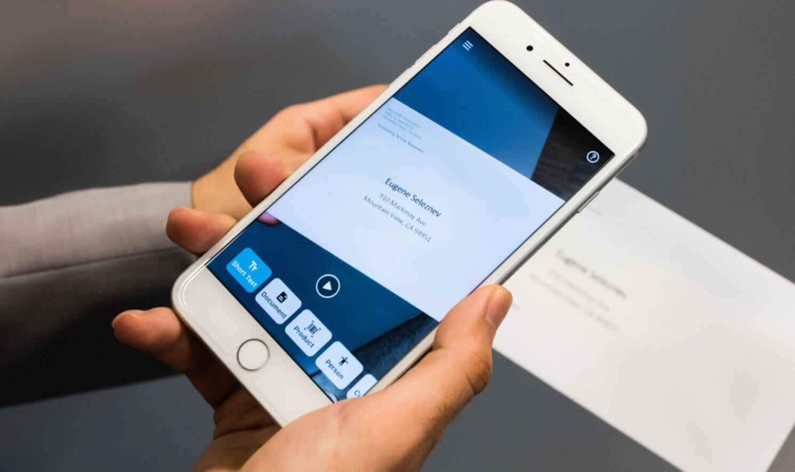
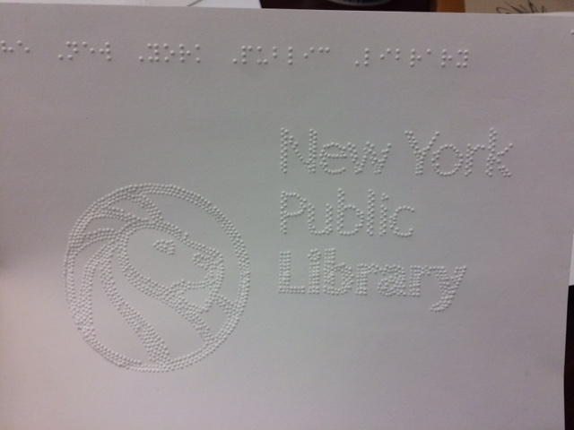
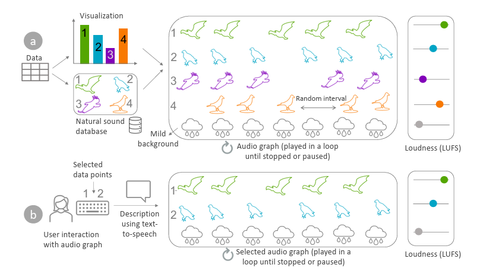
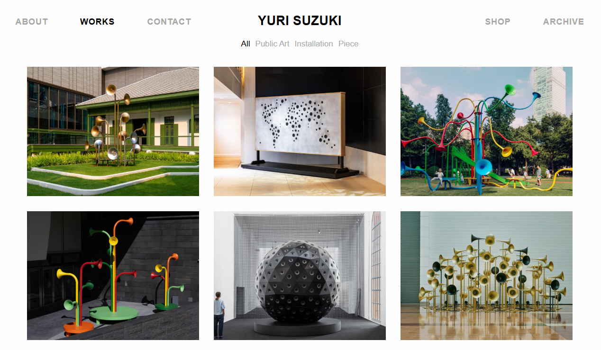

# **Toward a Sound-First AI Interface for the Blind**

## **Research Question(s)**

How can AI-powered interfaces better serve blind users by using sound as the primary communication mode? In what ways can sonic feedback replace or enhance visual UI to support independence, accessibility, and emotional well-being?

------

## **Keywords (6)**

sound-based UI, accessibility, assistive AI, blind UX, non-visual interface, inclusive design

------

## **3 Intersecting Fields**

1. Artificial Intelligence and real-time context awareness
2. Inclusive UX and accessibility technology
3. Sonic interaction and emotional computing

------

## **Historical Lineage**

- Accessibility-first app design (e.g., Be My Eyes, Seeing AI)
- AI-based emotion recognition and adaptive voice UI
- Plant sonification and sensory translation practices (e.g., "listening to trees")

------

## Community of Practice 

### Platform tools

**Microsoft — Seeing AI**

Its strength is availability: point-and-describe lowers friction for reading and scene cues. But precisely because it works well in episodic tasks, it entrenches a “caption as truth” habit where recognition is centralized, thresholds are opaque, and the user is funneled into waiting for a single authoritative answer. This narrows the interactional space to request/response and obscures model uncertainty and failure modes. My system treats its outputs as provisional signals—rendered as graded, spatialized sonics—so users can modulate granularity, hear confidence, and decide when to pivot rather than accept one-shot captions as the default.

**Be My Eyes / Be My AI**
Human-in-the-loop plus strong visual Q&A removes barriers for many micro-tasks, yet the exchange remains transactional and answer-maximizing: get the description, move on. That logic pushes cognitive risk onto the user when the model is wrong and, over time, deepens dependence on black-box mediation. I recast the help layer as *ambient and revisable*—short, low-burden sonic cues that can be re-queried, with user-controlled escalation to human support. In this framing, “assistance” is a spectrum of situated checks rather than a single, definitive description.

------

### Practitioner–advocates

**NYPL “Dimensions”**

Dimensions proves that when blind practitioners author tactile media, authorship and literacy shift to the community. The risk is that the model can still rely on fixed spaces, specialized tools, and a tactile-first skill ladder that newcomers may not have—leaving portability and broader participation unresolved. I adopt the governance lesson (co-ownership and public pedagogy) but translate it into low-barrier “sound-making studios,” where presets and mappings are co-authored, portable, and protected from enclosure.

**Chris Downey**
Downey’s practice shows that sound and touch are not afterthoughts but primary structures for spatial cognition. The danger is the heroic universalization of those insights across wildly different acoustics; what orients in a calm lobby may overwhelm in a reverberant station. I keep the spatial ethos—sound as place-making, not beeps—but require situated validation across diverse soundscapes before promoting any cue to a default.

------

### Academic research

**Penn State A11y Lab — Natural-sound sonification**

Susurrus maps each bar in a chart to a distinct natural sound (e.g., different birds) and sets its loudness with LUFS so that perceived volume is proportional to bar height; the mapped sounds are played **in parallel** on a loop over a mild ambient background with random intervals. Users can then select one or more bars via number keys to isolate those sounds and request text-to-speech descriptions—an interaction model aligned with AISA actions (gist, navigate, select, details-on-demand). 

The parallel “audio graph” helps users separate categories, but the design leans on loudness while the ambient bed and random intervals can complicate comparison at scale; the authors’ own studies show loudness works best, interval mapping confuses, duration mapping slows ordering, and parallel streams should be capped to ~five to avoid overload—constraints that the figure’s looping, backgrounded mix doesn’t reveal. In applying this technique, I’d keep the parallel LUFS mapping but add rules that limit concurrent voices, suppress or duck the ambience, and privilege stable timing when users are comparing bars—so the interface remains legible beyond small N.

------

### Artist/speculative practice (inspiration with constraints)

**Yuri Suzuki — \*Ambient Machine\***

Yuri Suzuki’s *Ambient Machine* proves that a tactile, layer-based approach to everyday sound can be inviting and legible: with banks of switches shaping volume, reverb, and tempo, it lets people compose ambience without screens. Yet the very elegance of this parameterized grid narrows what sound can communicate in an interactive system. It centers preset materials and a fixed control surface, making the user a one-way “composer” rather than a dialogue partner; it cannot express system intent or uncertainty, risks masking critical environmental cues outside quiet interiors, and places a memory burden on users to recall switch mappings—issues compounded by the lack of remapping, context awareness, and long-term fatigue management.

For a sound-first accessibility interface, I’d borrow the tactile immediacy and tunable layers but reframe them as a conversational medium. That means adding audible channels for confidence/intent, building anti-masking rules and context-aware sparsity, designing fatigue-sensitive timing, and enabling user-remappable controls paired with clear auditory confirmations. The sound library should be community-coauthored and governed (not just curated presets), while adaptation remains local and short-lived by default, portable on the user’s terms. Finally, spatial cues and any haptics should be validated across diverse real-world acoustics and kept optional—ensuring ambience becomes an accountable interaction language rather than a decorative soundtrack.

------

### Design stance distilled

Co-production over consumption; sound as primary structure, validated *in situ*; and power-aware defaults that make adaptation audible, keep traces local and ephemeral, and give users practical refusal and revision—not just permissions buried in policy.

### Relations with Precedent Studies

The project of my precedent study - "Measuring Diversity" - gives me the insights about caring more about those minorities. But I won't plan to build this project based on the precedent study since it is more algorithmic than what I want to present.

### **My Project’s Positioning**

- **Synthesis and Contribution**
  - Combines academic rigor with corporate critique and artistic inspiration.
  - Offers a reinterpretation of assistive technology—from functional tools to experiential, emotionally supportive companions.
  - Explicitly challenges the visual-dominant, screen-reader paradigm.
- **Audience vs. Community**
  - ***Primary Audience***: Blind and low-vision users. The design must prioritize their lived experience, participatory feedback, and emotional connection.
  - ***Community of Practice***: Includes:
    - Corporate teams (Microsoft, Be My Eyes and etc.).
    - HCI and accessibility researchers.
    - Sound artists and speculative designers.

------

## **Situated Technology**

This project is grounded in the CDP theme of alternative interfaces, proposing an auditory-first interaction system where sound—not visuals—provides presence, rhythm, and support. It relates to recent readings on sensory computation and experiential interfaces.

------

## **Methods**

- Web Audio API and voice synthesis for interface feedback
- LLMs for adaptive conversation and response
- Sound mapping of emotional and functional states
- Both qualitative and quantitative approaches
- Main components: computational, aesthetic, and material

------

## **Computational Design Experiments**

- Sonic-only form navigation demo (HTML/JS)
- Pitch-based feedback cues (e.g., success, failure, idle)
- “Digital ear” system that detects context and adapts voice
- Audio spectrogram mapping of common UX states

------

## **Visual Representation**

- Spectrogram diagrams of interface states
- Flowcharts of auditory pathways
- Sound-icon grammar chart
- Will draw aesthetic inspiration from sonic cartography and non-visual design language (used by artists like Yuri Suzuki)

------

## **Rhetorical Argument**

The mainstream “assistive” paradigm remains sight-normative: it centers the screen, translates cursor-and-caption metaphors into linear audio, and shifts the cost of model error onto blind users. One-shot descriptions present *caption-as-truth* while hiding uncertainty; transactional Q&A frames the user as a requester rather than a co-navigator; and layered alerts produce memory load, vigilance fatigue, and new dependencies disguised as autonomy.

This project rejects that status quo. It asserts sound as the primary structure of interaction—not ornament—and treats assistance as ambient, revisable, and accountable. Concretely: 
	(1) uncertainty and intent must be audible (graded confidence, spatialized cues); 
	(2) users must control granularity and pacing to avoid masking and overload; 
	(3) cues are context-aware and sparse, validated *in situ* across diverse acoustics; 
	(4) the sound palette and mappings are community-coauthored and remappable; 
	(5) adaptation is local-first and reversible, preserving agency over time. 

Success is measured not by recognition accuracy alone, but by repair speed, cognitive load reduction, and independent task completion. In short, a sound-first interface is not an accessibility add-on to visual UI; it is a competing human–computer interaction paradigm aimed at redistributing control back to blind users.

------

## **Potential Capstone Outline**

A functioning prototype of a sound-first website for visually impaired users, demonstrating intelligent voice response, sonic cues for interaction, and optional physical interface support.

Material gesture: a small wooden tactile device with audio feedback—part interface, part poetic object.

------

## **The Challenge**

- Ensuring clarity and usability using sound alone
- Balancing emotional subtlety with functional clarity
- Building a believable, non-intrusive AI persona
- Need to further improve coding and audio feedback systems

---

## Proposal for Drawing Type — Spectrogram-Based Vertical Mural  
**Concept**  

A vertically oriented mural that visualizes sound-first interactions for blind users, inspired by the structure of audio spectrograms and ambient soundscapes. The drawing serves as both a functional interaction diagram and a poetic visualization of sensory rhythm.

---

**Visual Structure**  

- **Vertical flow (top to bottom)** represents time-based user activities
- **Color gradients** correspond to tone/emotion shifts  
- **Waveform curves** represent different system states (idle, confirm, guide)  
- **Iconic symbols** layered over tone paths show user intent/actions

---

**Interaction Segments**  

1. **Morning Greeting / Context Check** 
2. **Navigation / Task Support**  
3. **Idle Listening / Ambient Awareness**  
4. **Shutdown / Sleep Ritual**

Each segment visually encodes a sonic logic: pitch, tempo, tone, duration.  

---

**References**  

- **Sonification art** (e.g., listening to trees, audio plants)    
- **Music notation** + **UX journey mapping** hybrid  
- **Google Sound Design Kit** for tone categorization

---

**Tools & Medium**  

- Designed in Figma or Illustrator  
- Printed on vertical scroll (e.g., textile or poster paper) ~36 inches tall  
- Supplemented by legend: pitch = action, color = tone, shape = function

---

**Purpose**  

This mural functions as:

- a visual translation of auditory interface logic  
- an emotional map of sound interactions  
- a centerpiece for exhibition 

---

## Proposal for Material Gesture — Sound-Reactive Interface Object  
**Concept**  

A tactile object that responds to user touch with sound cues. Designed for blind or low-vision users, it acts as a physical extension of the AI interface—part tool, part companion. The object embodies rhythm, care, and subtle emotional presence.

---

**Form**  

- Hand-sized, palm-friendly shape
- Soft wood or silicone shell with subtle texture
- Embedded with a microcontroller (e.g., Raspberry Pi Pico or Arduino Nano)  
- Small speaker or vibration motor inside for feedback

---

**Functions**  
- **Touch = Confirm tone**  
- **Long Press = Context-aware voice message**  
- **Rotate or Flip = Mode Switch (e.g., ambient / guided)**
- **Idle State = Breathing pulse or gentle hum**  

---

**References**  
- **Yuri Suzuki's Ambient Machine**  
- **“Be My Eyes” haptic alternatives**  
- **Music box / pocket object / worry stone metaphors**  

---

**Material Qualities**  
- Emphasizes warmth, intimacy, and calm 
- Sounds tuned to natural tones: wind chimes, wood knocks, soft sine waves 

---

**Exhibition Display**  

- Placed next to the spectrogram mural  
- Visitors can touch and interact with the object  
- Ambient audio playback loop may accompany it  

---

**Purpose**  

- Demonstrates tangible AI interaction for blind users  
- Offers poetic interpretation of sonic feedback  
- Bridges computational design with sensory embodiment
